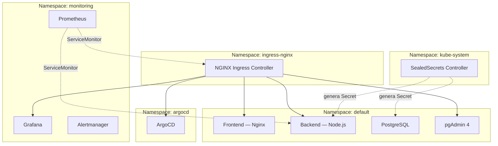

# 3.1–3.2 Arquitectura y Namespaces

## 3.1 Diseño de la Arquitectura y Flujo de Datos

Para demostrar la viabilidad del entorno, el diseño se ha planteado aislando completamente los servicios. El objetivo es evitar el clásico punto único de fallo (SPOF) de los sistemas monolíticos y garantizar que el flujo de datos sea unidireccional y auditable.

### Diagrama de arquitectura en tiempo de ejecución

```mermaid
flowchart TD
    User["🌐 Internet / Navegador"]
    Ingress["NGINX Ingress Controller\n— único punto de entrada —\nHTTPS forzado · TLS wildcard"]

    subgraph default["Namespace: default"]
        Frontend["Frontend\nNginx · 3 réplicas"]
        Backend["Backend\nNode.js · HPA 1-5 réplicas"]
        DB["PostgreSQL 15\nPVC 1 GiB"]
        pgAdmin["pgAdmin 4"]
    end

    subgraph monitoring["Namespace: monitoring"]
        Grafana["Grafana"]
        Prometheus["Prometheus"]
    end

    subgraph argocd_ns["Namespace: argocd"]
        ArgoCD["ArgoCD"]
    end

    User --> Ingress
    Ingress -->|"tfg-plataforma.test /"| Frontend
    Ingress -->|"tfg-plataforma.test /api"| Backend
    Ingress -->|"pgadmin.tfg-plataforma.test"| pgAdmin
    Ingress -->|"grafana.tfg-plataforma.test"| Grafana
    Ingress -->|"argocd.tfg-plataforma.test"| ArgoCD
    Frontend -->|"POST /api/leads"| Backend
    Backend -->|"SQL INSERT"| DB
    Prometheus -->|"scrape metrics"| Backend
    Prometheus -->|"scrape metrics"| Frontend
```

### Capas del flujo de datos

**1. Gestión perimetral (Ingress Controller)**

Todo el tráfico externo entra a través del controlador Ingress de Kubernetes. Los contenedores no se exponen directamente a la red mediante NodePorts por motivos de seguridad. El Ingress actúa como *proxy* inverso y balanceador de capa 7, leyendo la ruta HTTP solicitada para decidir a qué Service interno derivar la petición.

**2. Entrega de estáticos (*Frontend* — Nginx)**

Si la petición es a la raíz del dominio, el Ingress enruta el tráfico al *pod* de Nginx. Se ha elegido Nginx por su bajísimo consumo de recursos al servir HTML y JavaScript. Este *pod* no mantiene comunicación lógica con la base de datos ni dispone de variables de entorno sensibles. Si el *frontend* se viera comprometido, el atacante no tendría posibilidad de pivotar hacia los datos.

**3. Procesamiento y lógica (*Backend* — Node.js)**

Cuando el cliente envía el formulario web, la petición asíncrona (`POST /api/leads`) vuelve a entrar por el Ingress, que la redirige exclusivamente al microservicio de Node.js. El *backend* actúa como la única barrera de validación: filtra el *payload*, aplica la lógica de negocio y evita inyecciones o peticiones mal formadas.

**4. Persistencia segura (PostgreSQL)**

Node.js es el único componente autorizado a nivel de red interna para comunicarse con el servicio de PostgreSQL. Utiliza las credenciales cifradas que el operador SealedSecrets inyecta dinámicamente en el *pod*. Se abre la conexión, se ejecuta la transacción SQL y, al confirmarse la escritura, el *backend* devuelve el código HTTP correspondiente al usuario.

Este nivel de desacoplamiento permite, por ejemplo, escalar a tres réplicas el contenedor de Nginx ante un pico de tráfico web, sin tener que duplicar innecesariamente la base de datos ni el *backend*.

---

## 3.2 Gestión del *Cluster* y Aislamiento Lógico (Namespaces)

Uno de los pilares del diseño ha sido evitar el antipatrón de desplegar todos los recursos en el entorno por defecto (`default`). Para estructurar el *cluster* se ha implementado una segmentación estricta mediante Namespaces.

### Diagrama de aislamiento por Namespace



### Tabla de Namespaces

| Namespace | Contenido |
|-----------|-----------|
| `default` | *Frontend*, *Backend*, PostgreSQL, pgAdmin |
| `monitoring` | Prometheus, Grafana, Alertmanager |
| `argocd` | ArgoCD |
| `kube-system` | SealedSecrets |
| `ingress-nginx` | NGINX Ingress Controller |

### Justificación técnica

**1. Aislamiento operativo:** El Namespace `monitoring` se dedica exclusivamente al *stack* de observabilidad (Prometheus y Grafana). Esta separación garantiza que las herramientas de «Día 2» (operaciones) no interfieran con la carga de trabajo del negocio.

**2. Reducción del radio de explosión (*Blast Radius*):** Al separar entornos, una caída en cascada o un consumo excesivo de recursos por parte del recolector de métricas no afectará directamente a la disponibilidad del Ingress ni del *backend* de Node.js.

**3. Eficiencia en la depuración y trazabilidad:** La segmentación permite aislar el ruido al auditar el sistema o extraer *logs* de contenedores caídos. Un administrador puede monitorizar exclusivamente los eventos del Namespace de la aplicación sin verse inundado por los *logs* internos de las herramientas de monitorización.

**4. Base para seguridad y cuotas (RBAC):** Esta separación sienta las bases para aplicar un Control de Acceso Basado en Roles. Permite, por ejemplo, dar acceso de lectura a un operador técnico sobre el Namespace `monitoring` sin otorgarle permisos para modificar los *pods* de la base de datos de los clientes.

---

*Siguiente: [3.3 Flujo GitOps y CI/CD →](04-gitops-ci.md)*
