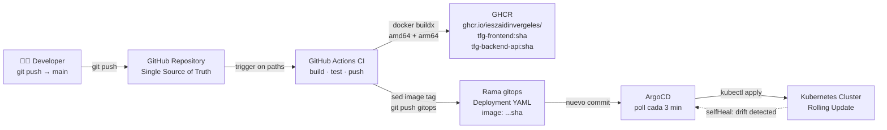
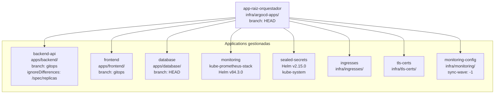

# 3.3 Flujo de *GitOps* y Automatización

## 3.3.1 Fase de Integración Continua (GitHub Actions)

Para erradicar el error humano inherente a las subidas de código manuales, se ha implementado un *pipeline* de integración continua (CI) basado en GitHub Actions. El objetivo de esta fase es transformar el código fuente en artefactos ejecutables e inmutables.

Se han definido dos flujos de trabajo independientes —uno por servicio— que se activan cuando se hace *push* a la rama `main`, pero únicamente si el *commit* modifica rutas relevantes: el *workflow* del *frontend* vigila `apps/frontend/**`, y el del *backend* vigila `src/backend/**`. De este modo, un cambio en el *frontend* no lanza innecesariamente la construcción del *backend*, y viceversa.

### Diagrama del pipeline CI/CD completo

### Artefactos generados

- **Artefacto *Frontend* (capa de presentación):** El *pipeline* construye una imagen tomando como base un servidor Nginx optimizado. Durante la compilación se inyectan los recursos estáticos (HTML, hojas de estilos CSS y *scripts* de cliente JavaScript) directamente en el directorio público del contenedor.

- **Artefacto *Backend* (API):** Se construye el entorno de lógica utilizando una imagen base de Node.js. El proceso copia el código de la API REST, resuelve e instala las dependencias y empaqueta el microservicio listo para recibir conexiones.

Una vez que la imagen supera la fase de construcción sin errores, el *pipeline* la etiqueta con dos referencias simultáneas (`latest` y el SHA del *commit*) y la publica en GHCR. El mismo *workflow* continúa con el paso `Update manifest on gitops branch`, que actualiza el manifiesto YAML correspondiente en la rama `gitops`. En este punto el nuevo código ya está empaquetado, publicado en el registro y declarado en el repositorio, a la espera de que ArgoCD lo aplique.

### 3.3.1.1 Compilación multiplataforma (*Multi-arch*)

Un aspecto crítico de este *pipeline* es el uso de Docker Buildx para generar imágenes multiplataforma. El flujo de GitHub Actions genera simultáneamente versiones compatibles con arquitectura `amd64` (el estándar de los servidores *cloud* de producción) y `arm64` (necesario para el entorno de desarrollo local basado en OrbStack sobre Apple Silicon). Esto garantiza la portabilidad y elimina el riesgo de incompatibilidades de *hardware* entre desarrollo y producción.

### 3.3.1.2 Versionado inmutable de imágenes y actualización automática de manifiestos

El *pipeline* publica cada imagen con dos etiquetas simultáneas: la etiqueta `latest` y el SHA completo del *commit* de Git que la originó. Con este doble etiquetado se garantiza la trazabilidad total del sistema, ya que cada imagen desplegada en producción queda vinculada de forma inequívoca con el *commit* exacto del que procede.

Una vez publicada la imagen, el propio *pipeline* —dotado del permiso `contents: write`— realiza un *checkout* de la rama `gitops`, modifica mediante `sed` el campo `image:` del manifiesto YAML correspondiente sustituyendo el SHA anterior por el nuevo, y efectúa automáticamente el *commit* y el *push*. De este modo se cierra el bucle de automatización: el desarrollador únicamente realiza el *push* del código fuente, y el *pipeline* construye la imagen, la publica en el registro y actualiza el manifiesto sin ninguna intervención humana adicional.

---

## 3.3.2 Fase de Despliegue Continuo (ArgoCD y *GitOps*)

El *deployment* de la infraestructura y de los microservicios se fundamenta estrictamente en el paradigma declarativo. Se ha eliminado por completo la intervención humana y el uso de comandos imperativos manuales como `kubectl apply -f`, los cuales generan configuraciones «fantasma», falta de trazabilidad y dependencia del administrador físico. En su lugar, el estado deseado de toda la infraestructura se define mediante manifiestos YAML versionados en el repositorio.

Para orquestar esta entrega continua, se ha implementado ArgoCD como controlador *GitOps* residente en el *cluster*. ArgoCD ejecuta un bucle de reconciliación constante que opera en tres pasos:

1. **Monitorización de la única fuente de la verdad:** El controlador audita de forma ininterrumpida la ruta especificada en el repositorio de GitHub buscando nuevos *commits*.
2. **Detección de discrepancias (*Drift Detection*):** Compara el estado «en vivo» del *cluster* de Kubernetes con el estado «declarado» en los manifiestos YAML.
3. **Auto-Sincronización:** Si se detecta una actualización en el código, o si un agente externo modifica manualmente algún recurso del *cluster*, ArgoCD interviene automáticamente (Auto-Sync). Aplica todas las configuraciones necesarias, reinicia los *pods* correspondientes mediante una estrategia de *Rolling Update* y devuelve la infraestructura al estado exacto dictado por el repositorio.

Para centralizar la gestión del enrutamiento HTTP, todos los manifiestos de tipo Ingress se han consolidado en una única ruta del repositorio (`infra/ingresses/`), gestionada por una Application de ArgoCD denominada `ingresses`.

### 3.3.2.1 Patrón *App of Apps* y orquestador raíz

Para centralizar la gestión del ciclo de vida de todas las Applications de ArgoCD, se ha implementado el patrón «*App of Apps*». Una Application especial denominada `app-raiz-orquestador` apunta al directorio `infra/argocd-apps/` del repositorio.

Desde ese único punto, ArgoCD detecta y gestiona todas las demás *applications*. Añadir una nueva carga de trabajo al *cluster* es tan sencillo como crear un fichero `.yml` en ese directorio y registrar el *commit*. Si el *cluster* se destruye y se recrea desde cero, basta con aplicar manualmente `app-raiz-orquestador.yml` para que toda la plataforma se restaure de forma automática.

### 3.3.2.2 Separación de ramas: `main` para desarrollo, `gitops` para producción

La rama `main` contiene el código fuente de las aplicaciones y los manifiestos de infraestructura que se editan directamente durante el ciclo de trabajo habitual. La rama `gitops`, en cambio, se gestiona de forma exclusiva por los *pipelines* de integración continua y no se edita manualmente bajo ninguna circunstancia. Es además la rama que ArgoCD monitoriza en su bucle de reconciliación.

Con esta separación se elimina una colisión clásica del modelo *GitOps*: si ArgoCD vigilara la rama `main`, los *commits* manuales del desarrollador y los *commits* automáticos del *bot* de integración continua competirían sobre la misma rama, generando conflictos de *merge* recurrentes.

---

*Siguiente: [3.3.3–3.3.4 Seguridad y TLS →](05-seguridad.md)*
