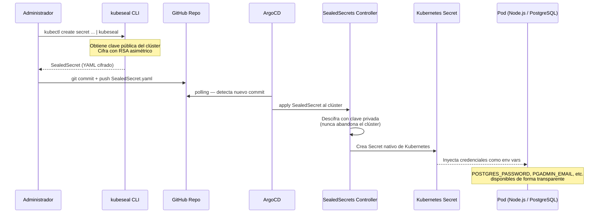

# 3.3.3–3.3.4 Seguridad y TLS

## 3.3.3 Gestión de Secretos en Entornos Abiertos (SealedSecrets)

El paradigma *GitOps* introduce una vulnerabilidad crítica por diseño: si el repositorio de GitHub es la única fuente de la verdad de la infraestructura, todos los manifiestos deben almacenarse en él. Subir contraseñas de bases de datos o *tokens* de acceso en texto plano o codificados en Base64 a un repositorio expuesto supone una grave negligencia de seguridad.

Para mitigar este vector de ataque, se ha integrado en el *cluster* el operador SealedSecrets (desarrollado por Bitnami), el cual resuelve la gestión de credenciales mediante criptografía asimétrica.

### Ciclo de vida de un secreto con SealedSecrets



### Fases del ciclo de vida

**1. Cifrado en origen (*Off-Cluster*):** El operador SealedSecrets genera un par de claves en el *cluster*. La clave privada se mantiene aislada y nunca abandona el entorno. Utilizando la herramienta de terminal `kubeseal`, el administrador cifra localmente el secreto con la clave pública antes de hacer el *commit*.

**2. Almacenamiento seguro (*GitOps*):** El resultado es un recurso personalizado de tipo SealedSecret. Al estar cifrado criptográficamente, este manifiesto YAML puede almacenarse y versionarse de forma completamente pública y segura en GitHub.

**3. Descifrado en destino (*On-Cluster*):** Cuando ArgoCD despliega este manifiesto cifrado en Kubernetes, el controlador interno de SealedSecrets lo intercepta, utiliza su clave privada para descifrar el contenido en memoria y genera dinámicamente un recurso Secret estándar de Kubernetes.

De esta forma, los *pods* de la aplicación (como Node.js o PostgreSQL) consumen los secretos de forma nativa y transparente, mientras el repositorio Git se mantiene libre de credenciales expuestas.

### Secretos gestionados en el proyecto

| SealedSecret | Namespace | Credenciales |
|---|---|---|
| `db-credentials` | `default` | `POSTGRES_PASSWORD` |
| `pgadmin-auth` | `default` | `PGADMIN_DEFAULT_EMAIL`, `PGADMIN_DEFAULT_PASSWORD` |
| `grafana-admin` | `monitoring` | `admin-user`, `admin-password` |
| `plataforma-tls` | `default` | Certificado TLS *wildcard* |
| `argocd-tls` | `argocd` | Certificado TLS de ArgoCD |
| `grafana-tls` | `monitoring` | Certificado TLS de Grafana |

> **Importante:** los SealedSecrets están ligados criptográficamente al *cluster* que los cifró. Si el *cluster* se recrea, es necesario volver a sellar los secretos con la nueva clave pública generada por el nuevo controlador.

---

## 3.3.4 Seguridad en el Transporte: TLS con Certificados de Confianza Local

Además de la gestión de secretos en reposo, se ha securizado la capa de transporte forzando HTTPS en todos los puntos de acceso de la plataforma.

En entornos locales de desarrollo, los certificados autofirmados convencionales presentan el inconveniente de que los navegadores los marcan como no seguros. Para resolverlo se ha utilizado mkcert, que instala una CA raíz en el Keychain del sistema operativo, de modo que Chrome y Safari muestran el candado verde sin advertencias.

### Configuración TLS

- Los certificados cubren el dominio `tfg-plataforma.test` y todos sus subdominios mediante un certificado *wildcard* (`*.tfg-plataforma.test`).
- Antes de almacenarse en el repositorio, las claves privadas de los certificados se cifran con SealedSecrets en `infra/tls-certs/`.
- El NGINX Ingress Controller está configurado con `ssl-redirect: "true"` en todos los Ingress, de modo que cualquier petición HTTP es redirigida automáticamente a HTTPS mediante un código 301.

### Dominios y certificados

| Dominio | Namespace del Secret TLS |
|---------|--------------------------|
| `tfg-plataforma.test` | `default` → `plataforma-tls` |
| `pgadmin.tfg-plataforma.test` | `default` → `pgadmin-tls` |
| `grafana.tfg-plataforma.test` | `monitoring` → `grafana-tls` |
| `argocd.tfg-plataforma.test` | `argocd` → `argocd-tls` |

### Comandos de generación y sellado de certificados TLS

```bash
# Instalar la CA de mkcert en el Keychain del sistema
mkcert -install

# Generar certificado wildcard para todos los subdominios
mkcert "tfg-plataforma.test" "*.tfg-plataforma.test"

# Sellar los secrets TLS para cada namespace
for args in "plataforma-tls default" "pgadmin-tls default" \
            "grafana-tls monitoring" "argocd-tls argocd"; do
  name=$(echo $args | cut -d' ' -f1)
  ns=$(echo $args | cut -d' ' -f2)
  kubectl create secret tls $name -n $ns \
    --cert=tfg-plataforma.test+1.pem \
    --key=tfg-plataforma.test+1-key.pem \
    --dry-run=client -o yaml | \
  kubeseal --controller-name=sealed-secrets \
           --controller-namespace=kube-system \
           --format yaml > infra/tls-certs/${name}.yaml
done

git add infra/tls-certs/
git commit -m "feat: add sealed TLS certificates"
git push
```

> **Firefox:** la CA de mkcert no se instala automáticamente en Firefox. Para añadirla manualmente: `about:preferences#privacy` → Ver certificados → Autoridades → Importar → seleccionar `~/Library/Application Support/mkcert/rootCA.pem`.

---

*Siguiente: [3.4 Observabilidad y Pruebas →](06-observabilidad.md)*
