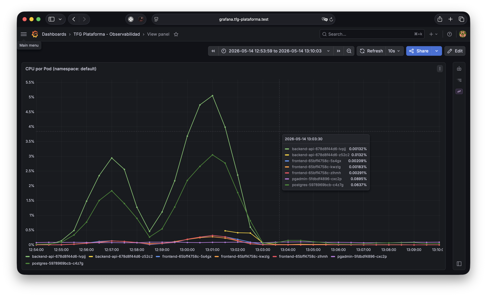

# 3.4 Operaciones y Observabilidad

Desplegar una arquitectura de microservicios en Kubernetes resuelve el problema del escalado, pero introduce un desafío técnico severo: la opacidad. Al distribuir la carga en múltiples contenedores efímeros, el *cluster* se convierte en una caja negra. Para garantizar la fiabilidad del sistema (el llamado «Día 2» de operaciones) se ha integrado el *stack* de monitorización compuesto por Prometheus y Grafana.

En un escenario sin monitorización, si el microservicio de Node.js sufriera una fuga de memoria (*memory leak*) o un pico de tráfico inasumible, el *pod* agotaría sus recursos y Kubernetes lo forzaría a un ciclo continuo de reinicios (CrashLoopBackOff). Al carecer de alertas tempranas, el administrador desconocería la degradación del servicio hasta que el impacto alcanzara la capa pública, traduciéndose en tiempos de espera agotados (*timeouts*) y respuestas HTTP 5xx.

Prometheus soluciona esto extrayendo constantemente las métricas vitales (CPU, RAM, red) de cada *pod* y nodo del *cluster*. Grafana centraliza estos datos de series temporales y los traduce en paneles visuales en tiempo real.

---

## 3.4.1 *Dashboard* Personalizado: TFG Plataforma — Observabilidad

Se ha creado un *dashboard* propio en Grafana mediante un ConfigMap de Kubernetes (`infra/monitoring/grafana-dashboard-tfg.yaml`) al que se ha añadido la etiqueta `grafana_dashboard: "1"`. Esta etiqueta es detectada automáticamente por el *sidecar* de Grafana, que carga el *dashboard* sin necesidad de reiniciar el *pod* del servidor.

El *dashboard* se refresca cada 10 segundos y muestra los últimos 15 minutos de datos, ofreciendo una visión casi en tiempo real del comportamiento de la plataforma. Los paneles se filtran al Namespace `default` e incluyen:

| Panel | Tipo | Métrica PromQL |
|-------|------|----------------|
| CPU por *Pod* | Series temporal | `sum(rate(container_cpu_usage_seconds_total{namespace="default"}[2m])) by (pod)` |
| Memoria por *Pod* | Series temporal | `sum(container_memory_working_set_bytes{namespace="default"}) by (pod)` |
| I/O Disco — Lecturas | Series temporal | `sum(rate(container_fs_reads_bytes_total{namespace="default"}[2m])) by (pod)` |
| I/O Disco — Escrituras | Series temporal | `sum(rate(container_fs_writes_bytes_total{namespace="default"}[2m])) by (pod)` |
| Red del Nodo — Recibido | Series temporal | `rate(node_network_receive_bytes_total{device="eth0"}[2m])` |
| Red del Nodo — Enviado | Series temporal | `rate(node_network_transmit_bytes_total{device="eth0"}[2m])` |
| CPU Total del Nodo | Series temporal | `1 - avg(rate(node_cpu_seconds_total{mode="idle"}[2m]))` |
| Réplicas disponibles | Estadístico | `kube_deployment_status_replicas_available{namespace="default"}` |

Gracias a este enfoque declarativo, el *dashboard* se mantiene versionado en Git junto al resto de la infraestructura, y ArgoCD se encarga de desplegarlo de forma automática durante la reconciliación del *cluster*.

### 3.4.1.1 Métricas del controlador NGINX Ingress

El controlador NGINX Ingress expone sus propias métricas HTTP en el puerto `10254` bajo la ruta `/metrics`. Sin embargo, Prometheus no las recoge por defecto, ya que no existe ningún ServiceMonitor que apunte a dicho *endpoint*.

Para resolver esta carencia se ha añadido el fichero `infra/monitoring/nginx-ingress-metrics.yaml`, en el que se definen dos recursos: un Service denominado `ingress-nginx-metrics`, ubicado en el Namespace `ingress-nginx` y que expone el puerto `10254`; y un ServiceMonitor (recurso CRD del Prometheus Operator) en el Namespace `monitoring`, configurado con un `namespaceSelector` apuntando a `ingress-nginx`, de manera que Prometheus extrae las métricas cada 15 segundos.

---

## 3.4.1.2 Pruebas de Carga con K6

Con el objetivo de validar que la plataforma soporta carga real de tráfico, se ha desarrollado el *script* `src/k6/carga-plataforma.js` empleando K6. El escenario de carga reproduce un patrón de tráfico realista estructurado en cinco etapas consecutivas:

| Etapa | Duración | Usuarios virtuales |
|-------|----------|--------------------|
| Rampa de subida | 30 s | 0 → 5 VU |
| Carga sostenida | 1 min | 20 VU |
| Pico de carga | 30 s | 5 → 50 VU |
| Carga máxima sostenida | 1 min | 50 VU |
| Rampa de bajada | 30 s | 50 → 0 VU |

Los umbrales (*thresholds*) definidos para considerar la prueba superada son:
- Percentil 95 de duración de peticiones: `p(95) < 2000 ms`
- Tasa de errores: `rate < 0.05` (menos del 5 %)

### *Dashboard* de Grafana durante la prueba de carga



---

## 3.4.2 Escalado Automático con HPA y Validación del Sistema

Para validar la capacidad de escalado horizontal de la plataforma, se ha configurado un HPA (*Horizontal Pod Autoscaler*) sobre el Deployment del *backend* con un umbral del 40 % de uso de CPU.

```bash
minikube addons enable metrics-server
```

Durante las primeras pruebas de carga se detectó un conflicto con el mecanismo de auto-recuperación de ArgoCD (`selfHeal: true`): ArgoCD revertía de inmediato las réplicas al valor declarado en el manifiesto Git (1 réplica), eliminando los *pods* que el HPA acababa de crear. La solución consistió en añadir la directiva `ignoreDifferences` en la Application de ArgoCD correspondiente para que ignorase el campo `/spec/replicas`.

### Resultados del *test* de carga

| Métrica | Resultado |
|---------|-----------|
| CPU durante el pico | > 60 % → HPA escaló de 1 a 2 réplicas |
| CPU tras el escalado | 41 % (próxima al umbral del 40 %) |
| *Checks* superados | 100 % (frontend HTTP 200, *leads* HTTP 201, campo `message` presente) |
| Percentil 95 de latencia | 22,43 ms (umbral: 2 000 ms) |
| Tasa de errores | 0 % |
| Total de peticiones procesadas | 7 422 en 3 min 30 s |

Estos resultados demuestran que la plataforma escala horizontalmente de forma autónoma ante picos de tráfico y recupera los niveles de servicio sin intervención manual.

### Estado del HPA antes de la prueba


### Estado del HPA durante la prueba (pico: 50 VU)


### Estado del HPA tras la prueba


---

*Siguiente: [3.5 Modelo de Datos y API →](07-api.md)*
