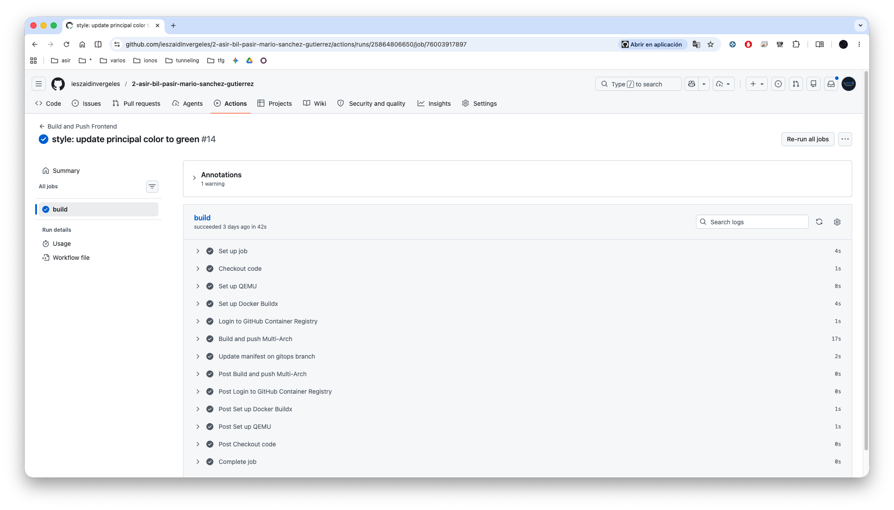
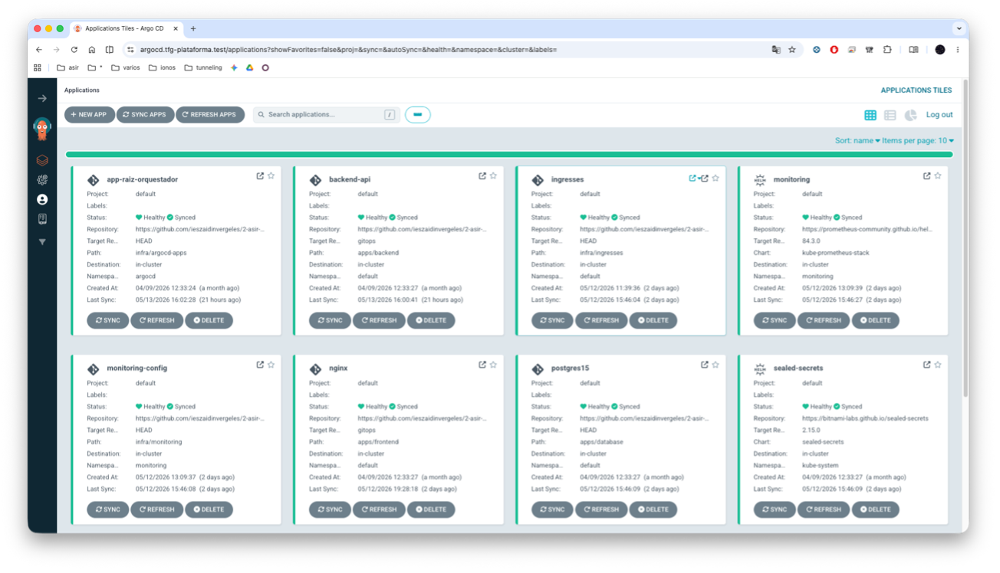
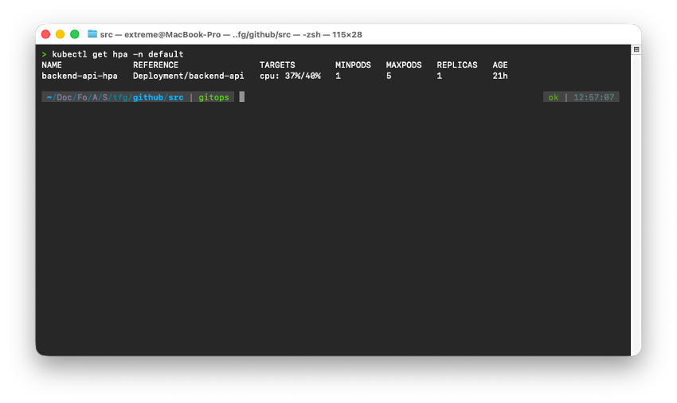
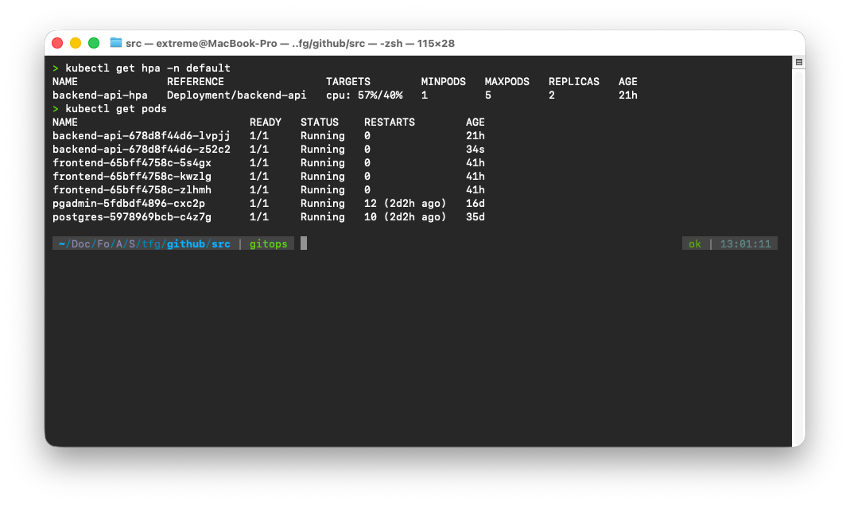
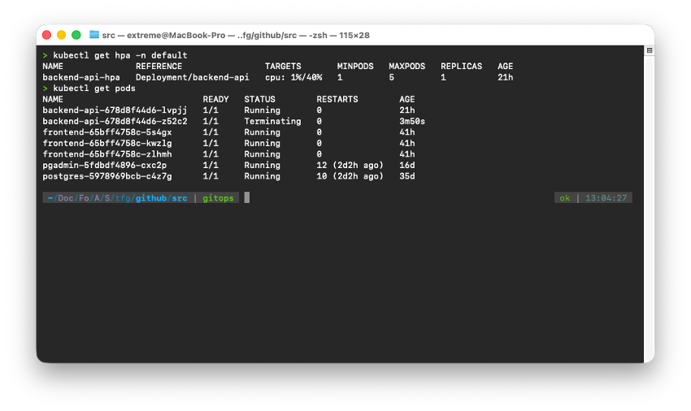

# 4. Anexos

## 4.1 Anexo A. Estructura del Repositorio

El repositorio principal trabaja con dos ramas diferenciadas: la rama `main`, que contiene el código fuente de cada componente, la infraestructura como código y la configuración de los *workflows* de integración continua; y la rama `gitops`, gestionada exclusivamente por los *pipelines* de CI y utilizada por ArgoCD como fuente de verdad para el *deployment* continuo.

```
.
├── .github/
│   └── workflows/
│       ├── ci-backend.yml       # Pipeline CI: construye y publica imagen del backend
│       └── ci-frontend.yml      # Pipeline CI: construye y publica imagen del frontend
│
├── apps/                        # Manifiestos de las aplicaciones
│   ├── backend/
│   │   ├── deployment.yml       # Deployment del backend (Node.js)
│   │   ├── service.yml          # Service ClusterIP del backend
│   │   └── hpa.yml              # HorizontalPodAutoscaler del backend
│   ├── database/
│   │   ├── postgres-db.yml              # Deployment + Service + PVC de PostgreSQL
│   │   ├── postgres-sealed-secret.yaml  # Credenciales de PostgreSQL (cifradas)
│   │   ├── pgadmin.yml                  # Deployment + Service de pgAdmin
│   │   └── pgadmin-sealed-secret.yaml   # Credenciales de pgAdmin (cifradas)
│   └── frontend/
│       ├── frontend.yml         # Deployment + Service del frontend (3 réplicas)
│       ├── dockerfile           # Imagen Docker del frontend
│       ├── index.html           # Página principal de la plataforma
│       ├── css/styles.css       # Estilos
│       └── js/app.js            # Lógica del formulario (fetch POST /api/leads)
│
├── infra/                       # Infraestructura gestionada por ArgoCD
│   ├── argocd-apps/             # Definiciones de Applications de ArgoCD (App of Apps)
│   │   ├── app-raiz-orquestador.yml  # App raíz: gestiona todos los demás apps
│   │   ├── backend.yml          # ArgoCD app → apps/backend/
│   │   ├── database.yml         # ArgoCD app → apps/database/
│   │   ├── fronted.yml          # ArgoCD app → apps/frontend/
│   │   ├── monitoring.yml       # ArgoCD app → kube-prometheus-stack (Helm)
│   │   ├── ingresses-app.yml    # ArgoCD app → infra/ingresses/
│   │   ├── sealed-secrets-app.yml    # ArgoCD app → SealedSecrets (Helm)
│   │   └── tls-certs-app.yml    # ArgoCD app → infra/tls-certs/
│   ├── ingresses/               # Todos los Ingress de la plataforma
│   │   ├── plataforma-ingress.yml    # Frontend + Backend (tfg-plataforma.test)
│   │   ├── pgadmin-ingress.yml       # pgAdmin
│   │   ├── grafana-ingress.yml       # Grafana (namespace: monitoring)
│   │   └── argocd-ingress.yml        # ArgoCD
│   ├── monitoring/              # Configuración del stack de monitorización
│   │   ├── grafana-dashboard-tfg.yaml    # Dashboard personalizado (ConfigMap)
│   │   └── nginx-ingress-metrics.yaml    # Service + ServiceMonitor para NGINX Ingress
│   └── tls-certs/               # SealedSecrets con certificados TLS
│       ├── plataforma-tls.yaml
│       ├── pgadmin-tls.yaml
│       ├── grafana-tls.yaml
│       └── argocd-tls.yaml
│
├── src/
│   ├── backend/
│   │   ├── server.js            # Código fuente del backend (Express + pg)
│   │   ├── package.json
│   │   └── dockerfile           # Imagen Docker del backend
│   └── k6/
│       └── carga-plataforma.js  # Script de pruebas de carga
│
└── docs/                        # Documentación técnica (este sitio)
    ├── index.html               # Docsify entry point
    ├── _sidebar.md
    ├── README.md
    └── assets/                  # Capturas de evidencia
```

---

## 4.2 Anexo B. Manifiestos YAML Clave

### B.1. *Deployment* del Servicio *Backend*

```yaml
# apps/backend/deployment.yml
apiVersion: apps/v1
kind: Deployment
metadata:
  name: backend-api
  namespace: default
spec:
  replicas: 1
  selector:
    matchLabels:
      app: backend-api
  template:
    metadata:
      labels:
        app: backend-api
    spec:
      containers:
      - name: api
        image: ghcr.io/ieszaidinvergeles/tfg-backend-api:latest
        imagePullPolicy: Always
        ports:
        - containerPort: 3000
        resources:
          requests:
            cpu: "100m"
            memory: "128Mi"
          limits:
            cpu: "500m"
            memory: "256Mi"
        env:
        - name: DB_HOST
          value: "postgres-service"
        - name: POSTGRES_PASSWORD
          valueFrom:
            secretKeyRef:
              name: db-credentials
              key: postgres-password
```

### B.2. HPA del *Backend*

```yaml
# apps/backend/hpa.yml
apiVersion: autoscaling/v2
kind: HorizontalPodAutoscaler
metadata:
  name: backend-api-hpa
  namespace: default
spec:
  scaleTargetRef:
    apiVersion: apps/v1
    kind: Deployment
    name: backend-api
  minReplicas: 1
  maxReplicas: 5
  metrics:
  - type: Resource
    resource:
      name: cpu
      target:
        type: Utilization
        averageUtilization: 40
  behavior:
    scaleUp:
      stabilizationWindowSeconds: 30
      policies:
      - type: Pods
        value: 2
        periodSeconds: 30
    scaleDown:
      stabilizationWindowSeconds: 120
```

### B.3. *Deployment* de PostgreSQL con PVC

```yaml
# apps/database/postgres-db.yml
---
apiVersion: v1
kind: PersistentVolumeClaim
metadata:
  name: postgres-pvc
spec:
  accessModes:
    - ReadWriteOnce
  resources:
    requests:
      storage: 1Gi
---
apiVersion: apps/v1
kind: Deployment
metadata:
  name: postgres
spec:
  replicas: 2
  selector:
    matchLabels:
      app: postgres
  template:
    metadata:
      labels:
        app: postgres
    spec:
      containers:
        - name: postgres
          image: postgres:15
          env:
            - name: POSTGRES_PASSWORD
              valueFrom:
                secretKeyRef:
                  name: db-credentials
                  key: postgres-password
          ports:
            - containerPort: 5432
          volumeMounts:
            - name: postgres-storage
              mountPath: /var/lib/postgresql/data
      volumes:
        - name: postgres-storage
          persistentVolumeClaim:
            claimName: postgres-pvc
---
apiVersion: v1
kind: Service
metadata:
  name: postgres-service
spec:
  type: NodePort
  selector:
    app: postgres
  ports:
    - protocol: TCP
      port: 5432
      targetPort: 5432
      nodePort: 30001
```

### B.4. *Deployment* del *Frontend* (3 réplicas)

```yaml
# apps/frontend/frontend.yml
apiVersion: apps/v1
kind: Deployment
metadata:
  name: frontend
  labels:
    app: frontend
spec:
  replicas: 3
  selector:
    matchLabels:
      app: frontend
  template:
    metadata:
      labels:
        app: frontend
    spec:
      containers:
      - name: frontend
        image: ghcr.io/ieszaidinvergeles/tfg-frontend:latest
        imagePullPolicy: Always
        ports:
        - containerPort: 80
---
apiVersion: v1
kind: Service
metadata:
  name: frontend-service
spec:
  selector:
    app: frontend
  ports:
    - protocol: TCP
      port: 80
      targetPort: 80
```

### B.5. Application Raíz de ArgoCD (*App of Apps*)

```yaml
# infra/argocd-apps/app-raiz-orquestador.yml
apiVersion: argoproj.io/v1alpha1
kind: Application
metadata:
  name: app-raiz-orquestador
  namespace: argocd
spec:
  project: default
  source:
    repoURL: 'https://github.com/ieszaidinvergeles/2-asir-bil-pasir-mario-sanchez-gutierrez.git'
    targetRevision: HEAD
    path: infra/argocd-apps
  destination:
    server: 'https://kubernetes.default.svc'
    namespace: argocd
  syncPolicy:
    automated:
      prune: true
      selfHeal: true
```

### B.6. Application de ArgoCD para el *Backend* (con `ignoreDifferences`)

```yaml
# infra/argocd-apps/backend.yml
apiVersion: argoproj.io/v1alpha1
kind: Application
metadata:
  name: backend-api
  namespace: argocd
spec:
  project: default
  source:
    repoURL: 'https://github.com/ieszaidinvergeles/2-asir-bil-pasir-mario-sanchez-gutierrez.git'
    targetRevision: gitops
    path: apps/backend
  destination:
    server: 'https://kubernetes.default.svc'
    namespace: default
  ignoreDifferences:
  - group: apps
    kind: Deployment
    jsonPointers:
    - /spec/replicas
  syncPolicy:
    automated:
      prune: true
      selfHeal: true
```

### B.7. Application de ArgoCD para Monitoring (Helm)

```yaml
# infra/argocd-apps/monitoring.yml
apiVersion: argoproj.io/v1alpha1
kind: Application
metadata:
  name: monitoring
  namespace: argocd
spec:
  project: default
  source:
    repoURL: 'https://prometheus-community.github.io/helm-charts'
    chart: kube-prometheus-stack
    targetRevision: 84.3.0
    helm:
      releaseName: prometheus
      values: |
        grafana:
          admin:
            existingSecret: grafana-admin
            userKey: admin-user
            passwordKey: admin-password
  destination:
    server: 'https://kubernetes.default.svc'
    namespace: monitoring
  syncPolicy:
    automated:
      prune: true
      selfHeal: true
    syncOptions:
      - CreateNamespace=true
      - ServerSideApply=true
```

### B.8. Application de ArgoCD para SealedSecrets (Helm)

```yaml
# infra/argocd-apps/sealed-secrets-app.yml
apiVersion: argoproj.io/v1alpha1
kind: Application
metadata:
  name: sealed-secrets
  namespace: argocd
spec:
  project: default
  source:
    repoURL: 'https://bitnami-labs.github.io/sealed-secrets'
    chart: sealed-secrets
    targetRevision: 2.15.0
  destination:
    server: 'https://kubernetes.default.svc'
    namespace: kube-system
  syncPolicy:
    automated:
      prune: true
      selfHeal: true
    syncOptions:
    - CreateNamespace=true
```

### B.9. Ingress de la Plataforma

```yaml
# infra/ingresses/plataforma-ingress.yml
apiVersion: networking.k8s.io/v1
kind: Ingress
metadata:
  name: plataforma-ingress
  namespace: default
  annotations:
    nginx.ingress.kubernetes.io/rewrite-target: /$2
    nginx.ingress.kubernetes.io/ssl-redirect: "true"
spec:
  ingressClassName: nginx
  tls:
  - hosts:
    - tfg-plataforma.test
    secretName: plataforma-tls
  rules:
  - host: tfg-plataforma.test
    http:
      paths:
      - path: /api(/|$)(.*)
        pathType: ImplementationSpecific
        backend:
          service:
            name: backend-service
            port:
              number: 3000
      - path: /()(.*)
        pathType: ImplementationSpecific
        backend:
          service:
            name: frontend-service
            port:
              number: 80
```

### B.10. Ingress de ArgoCD

```yaml
# infra/ingresses/argocd-ingress.yml
apiVersion: networking.k8s.io/v1
kind: Ingress
metadata:
  name: argocd-ingress
  namespace: argocd
  annotations:
    nginx.ingress.kubernetes.io/ssl-redirect: "true"
spec:
  ingressClassName: nginx
  tls:
  - hosts:
    - argocd.tfg-plataforma.test
    secretName: argocd-tls
  rules:
  - host: argocd.tfg-plataforma.test
    http:
      paths:
      - path: /
        pathType: Prefix
        backend:
          service:
            name: argocd-server
            port:
              number: 80
```

### B.11. ServiceMonitor para Métricas del NGINX Ingress

```yaml
# infra/monitoring/nginx-ingress-metrics.yaml
---
apiVersion: v1
kind: Service
metadata:
  name: ingress-nginx-metrics
  namespace: ingress-nginx
  labels:
    app.kubernetes.io/name: ingress-nginx
    app.kubernetes.io/component: controller
spec:
  selector:
    app.kubernetes.io/name: ingress-nginx
    app.kubernetes.io/component: controller
  ports:
  - name: metrics
    port: 10254
    targetPort: 10254
---
apiVersion: monitoring.coreos.com/v1
kind: ServiceMonitor
metadata:
  name: ingress-nginx
  namespace: monitoring
  labels:
    release: prometheus
spec:
  namespaceSelector:
    matchNames:
    - ingress-nginx
  selector:
    matchLabels:
      app.kubernetes.io/name: ingress-nginx
      app.kubernetes.io/component: controller
  endpoints:
  - port: metrics
    path: /metrics
    interval: 15s
```

---

## 4.3 Anexo C. *Workflows* de GitHub Actions

### C.1. `ci-frontend.yml`

```yaml
# .github/workflows/ci-frontend.yml
name: Build and Push Frontend

on:
  push:
    branches:
      - main
    paths:
      - 'apps/frontend/**'
env:
  FORCE_JAVASCRIPT_ACTIONS_TO_NODE24: true

jobs:
  build:
    runs-on: ubuntu-latest
    permissions:
      packages: write
      contents: write
    steps:
    - name: Checkout code
      uses: actions/checkout@v4

    - name: Set up QEMU
      uses: docker/setup-qemu-action@v3

    - name: Set up Docker Buildx
      uses: docker/setup-buildx-action@v3

    - name: Login to GitHub Container Registry
      uses: docker/login-action@v3
      with:
        registry: ghcr.io
        username: ${{ github.actor }}
        password: ${{ secrets.GITHUB_TOKEN }}

    - name: Build and push Multi-Arch
      uses: docker/build-push-action@v5
      with:
        context: ./apps/frontend
        push: true
        tags: |
          ghcr.io/${{ github.repository_owner }}/tfg-frontend:latest
          ghcr.io/${{ github.repository_owner }}/tfg-frontend:${{ github.sha }}
        platforms: linux/amd64,linux/arm64

    - name: Update manifest on gitops branch
      run: |
        git config user.name "github-actions[bot]"
        git config user.email "github-actions[bot]@users.noreply.github.com"
        git fetch origin gitops 2>/dev/null || true
        git checkout -B gitops origin/gitops 2>/dev/null || git checkout -b gitops
        sed -i "s|ghcr.io/ieszaidinvergeles/tfg-frontend:.*|ghcr.io/ieszaidinvergeles/tfg-frontend:${{ github.sha }}|" apps/frontend/frontend.yml
        git add apps/frontend/frontend.yml
        git diff --cached --quiet || git commit -m "ci: update frontend image to ${{ github.sha }}"
        git push origin gitops
```

### C.2. `ci-backend.yml`

```yaml
# .github/workflows/ci-backend.yml
name: Build and Push Backend API

on:
  push:
    branches:
      - main
    paths:
      - 'src/backend/**'
env:
  FORCE_JAVASCRIPT_ACTIONS_TO_NODE24: true

jobs:
  build:
    runs-on: ubuntu-latest
    permissions:
      packages: write
      contents: write
    steps:
    - name: Checkout code
      uses: actions/checkout@v4

    - name: Set up QEMU
      uses: docker/setup-qemu-action@v3

    - name: Set up Docker Buildx
      uses: docker/setup-buildx-action@v3

    - name: Login to GitHub Container Registry
      uses: docker/login-action@v3
      with:
        registry: ghcr.io
        username: ${{ github.actor }}
        password: ${{ secrets.GITHUB_TOKEN }}

    - name: Build and push Multi-Arch
      uses: docker/build-push-action@v5
      with:
        context: ./src/backend
        push: true
        tags: |
          ghcr.io/${{ github.repository_owner }}/tfg-backend-api:latest
          ghcr.io/${{ github.repository_owner }}/tfg-backend-api:${{ github.sha }}
        platforms: linux/amd64,linux/arm64

    - name: Update manifest on gitops branch
      run: |
        git config user.name "github-actions[bot]"
        git config user.email "github-actions[bot]@users.noreply.github.com"
        git fetch origin gitops 2>/dev/null || true
        git checkout -B gitops origin/gitops 2>/dev/null || git checkout -b gitops
        sed -i "s|ghcr.io/ieszaidinvergeles/tfg-backend-api:.*|ghcr.io/ieszaidinvergeles/tfg-backend-api:${{ github.sha }}|" apps/backend/deployment.yml
        git add apps/backend/deployment.yml
        git diff --cached --quiet || git commit -m "ci: update backend image to ${{ github.sha }}"
        git push origin gitops
```

---

## 4.4 Anexo D. Capturas del Pipeline CI/CD

### D.1. Pipeline de GitHub Actions completado

La siguiente imagen muestra la ejecución satisfactoria del *workflow* de integración continua, con todos los pasos —construcción *multi-arch*, publicación en GHCR y actualización del manifiesto en la rama `gitops`— completados sin errores.



### D.2. Estado *Healthy/Synced* en ArgoCD

La siguiente imagen muestra el *dashboard* de ArgoCD con todas las Applications en estado `Healthy` y `Synced`, confirmando que la plataforma completa está operativa y alineada con el estado declarado en el repositorio.



---

## 4.5 Anexo E. Script de Prueba de Carga K6

```javascript
// src/k6/carga-plataforma.js
import http from 'k6/http';
import { check, sleep } from 'k6';
import { Rate, Trend } from 'k6/metrics';

const errorRate = new Rate('errores');
const duracionPeticion = new Trend('duracion_peticion', true);

export const options = {
  stages: [
    { duration: '30s', target: 5  },  // Rampa de subida: 0 → 5 usuarios
    { duration: '1m',  target: 20 },  // Carga sostenida: 20 usuarios
    { duration: '30s', target: 50 },  // Pico de carga: 50 usuarios
    { duration: '1m',  target: 50 },  // Carga máxima sostenida
    { duration: '30s', target: 0  },  // Rampa de bajada
  ],
  thresholds: {
    http_req_duration: ['p(95)<2000'], // El 95% de peticiones < 2 s
    errores:           ['rate<0.05'],  // Menos del 5% de errores
  },
};

const BASE_URL = 'https://tfg-plataforma.test';

const LEAD_PAYLOAD = JSON.stringify({
  nombre:  'Usuario Test',
  email:   'test@ejemplo.com',
  empresa: 'Empresa Test SL',
});

const HEADERS = {
  'Content-Type': 'application/json',
  'Accept':       'application/json',
};

export default function () {
  const resHome = http.get(`${BASE_URL}/`, { tags: { name: 'frontend' } });
  check(resHome, { 'frontend OK (200)': (r) => r.status === 200 });
  errorRate.add(resHome.status !== 200);
  duracionPeticion.add(resHome.timings.duration, { endpoint: 'frontend' });

  sleep(0.5);

  const resApi = http.post(`${BASE_URL}/api/leads`, LEAD_PAYLOAD, {
    headers: { ...HEADERS },
    tags: { name: 'api-leads' },
  });
  check(resApi, {
    'api /leads OK (201)':     (r) => r.status === 201,
    'respuesta tiene message': (r) => JSON.parse(r.body || '{}').message !== undefined,
  });
  errorRate.add(resApi.status >= 400);
  duracionPeticion.add(resApi.timings.duration, { endpoint: 'api-leads' });

  sleep(1);
}
```

---

## 4.6 Anexo F. Escalado Automático con HPA — Evidencias

### F.1. Estado del HPA antes de la prueba



### F.2. Estado del HPA durante la prueba (50 VU activos)



### F.3. Estado del HPA tras la prueba



---

*Siguiente: [5. Recursos Bibliográficos →](09-bibliografia.md)*
