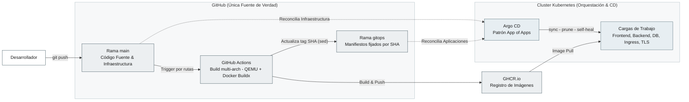
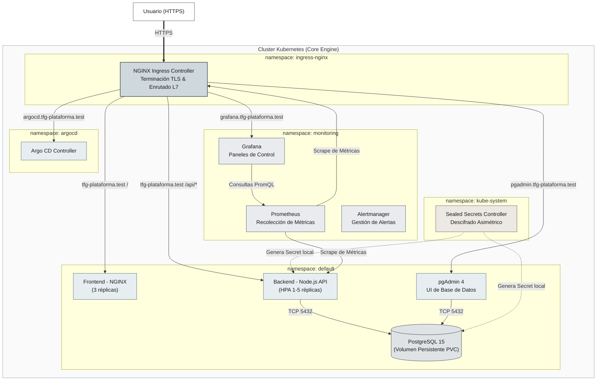

# PaaS Engine: Plataforma Cloud-Native de Alto Rendimiento y GitOps Inmutable

[](https://kubernetes.io)
[](https://argoproj.github.io/cd/)
[](https://github.com/features/actions)
[](https://prometheus.io)
[](https://grafana.com)
[](https://www.docker.com)

Un motor de **Plataforma como Servicio (PaaS)** empresarial diseñado para modernizar y automatizar el ciclo de vida de aplicaciones sobre Kubernetes. Utilizando el paradigma **GitOps** y una filosofía de **Infraestructura como Código (IaC)**, este proyecto elimina la deriva de configuración (*configuration drift*), asegura alta disponibilidad con cero tiempo de inactividad, y automatiza la cadena de suministro de software desde el commit del desarrollador hasta la producción.

---

## El Reto de Negocio y La Solución

* **El Problema:** La administración tradicional de sistemas sufre de entornos frágiles, caídas de servicio durante actualizaciones, "servidores copo de nieve" (Snowflake Servers) causados por cambios manuales no auditados y brechas de seguridad al gestionar credenciales en texto plano.
* **La Solución (PaaS Engine):** Una infraestructura completamente declarativa donde **Git es la Única Fuente de Verdad**.
  * **Auto-curación (Self-Healing):** Reconciliación continua que revierte cualquier manipulación manual no autorizada en milisegundos.
  * **Cero Intervención Humana en Producción:** Despliegues automatizados basados en el modelo "Pull" a través de ArgoCD.
  * **Seguridad por Diseño (Zero-Trust):** Cifrado asimétrico de credenciales en Git y HTTPS forzado de extremo a extremo.

---

## Arquitectura del Sistema

La plataforma se despliega siguiendo una arquitectura altamente desacoplada en Namespaces aislados lógicamente, garantizando seguridad y separación de responsabilidades (*Separation of Concerns*).

### 1. Cadena de Suministro (CI/CD GitOps)


### 2. Arquitectura de Ejecución (Runtime)


---

## Stack Tecnológico Detallado

| Componente | Tecnología | Rol Técnico |
|---|---|---|
| **Orquestación** | **Kubernetes** | Abstracción de cómputo, red y almacenamiento persistente. |
| **GitOps Engine** | **ArgoCD** | Reconciliador de estado deseado (Git) vs. real (Cluster) usando patrón *App of Apps*. |
| **CI / Automatización**| **GitHub Actions** | Compilación multi-arquitectura nativa (`amd64` y `arm64`) y actualización del tag SHA. |
| **Seguridad de Secretos**| **Bitnami Sealed Secrets**| Criptografía asimétrica para versionar credenciales de forma segura en repositorios públicos. |
| **Seguridad en Transporte**| **mkcert + Nginx Ingress**| CA local y certificados wildcard (`*.tfg-plataforma.test`) con redirección forzada HTTPS 301. |
| **Observabilidad** | **Prometheus + Grafana** | Recolección automatizada de métricas de red/infraestructura e inyección declarativa de Dashboards. |
| **Pruebas de Carga** | **k6 (Grafana)** | Escenarios de carga realistas y verificación de SLAs. |
| **Escalado Dinámico** | **HPA (Horizontal Pod Autoscaler)**| Auto-escalado de pods de API REST basado en carga de CPU. |

---

## Decisiones de Ingeniería de Alto Impacto

### Multi-arch Docker Buildx y Portabilidad Total
Para optimizar el ciclo de desarrollo (*Developer Experience*), el pipeline CI/CD en GitHub Actions utiliza **Docker Buildx con QEMU** para compilar y empaquetar de forma transparente imágenes duales: `linux/amd64` (producción/cloud) y `linux/arm64` (desarrollo local sobre Apple Silicon en OrbStack/Docker). Esto previene fallos del tipo *"it works on my machine"* en la capa de hardware.

### Criptografía Asimétrica (GitOps sin fugas de secretos)
En lugar de almacenar credenciales codificadas en Base64 (lo cual no es seguro), se ha desplegado el controlador **Sealed Secrets**. Las contraseñas de PostgreSQL, credenciales de administración de Grafana y llaves privadas TLS se cifran en local con una llave pública del clúster utilizando la CLI `kubeseal`. El YAML resultante es seguro para subirse a GitHub, y el controlador en la nube lo descifra en memoria caliente para generar los secretos nativos de Kubernetes.

### Solución al Conflicto de Replicación: HPA vs ArgoCD
Al habilitar el escalado automático con **HPA (Horizontal Pod Autoscaler)** en la API backend y la auto-curación de ArgoCD (`selfHeal: true`), surgió un conflicto clásico: HPA creaba pods para mitigar la carga de CPU, pero ArgoCD los eliminaba de inmediato para coincidir con la réplica declarada en Git (1 réplica).
* **Solución aplicada:** Se configuró la directiva `ignoreDifferences: /spec/replicas` en la Application de ArgoCD. Esto permite al HPA escalar libremente de 1 a 5 réplicas de forma reactiva, mientras ArgoCD sigue controlando el resto del ciclo de vida y la configuración del Deployment.

---

## Métricas de Validación y Pruebas de Carga (k6)

Se evaluó la resiliencia de la plataforma bajo un test de carga realista compuesto por 5 fases (escalas de hasta 50 usuarios virtuales concurrentes).

* **Peticiones procesadas:** 7,422 peticiones exitosas en 3 min 30 s.
* **Tasa de error:** **0.00%** (todas las peticiones del frontend y API retornaron código HTTP 2xx/3xx).
* **Latencia Promedio (p95):** **22.43 ms** (muy por debajo del límite de SLA definido de 2,000 ms).
* **Comportamiento del Auto-escalado (HPA):** Al superar el 40% de CPU en los pods backend durante el pico de carga, el HPA escaló el microservicio de forma autónoma. Una vez finalizada la prueba, redujo el clúster a su estado base de 1 réplica de manera ordenada.

---

## Estructura del Repositorio

```text
├── .github/workflows/   # Pipelines de CI multi-arch (frontend y backend)
├── apps/
│   ├── backend/         # Manifiestos K8s de la API y HPA
│   ├── database/        # Despliegue persistente de PostgreSQL 15
│   └── frontend/        # Contenedor de presentación Nginx y manifiestos K8s
├── docs/                # Documentación detallada del proyecto (AsciiDoc / Markdown)
├── infra/
│   ├── argocd-apps/     # Aplicaciones gestionadas por el patrón App of Apps
│   ├── ingresses/       # Reglas de enrutamiento TLS y paths
│   ├── monitoring/      # Configuración de Prometheus, Grafana y Dashboards declarativos
│   └── tls-certs/       # Certificados TLS cifrados con Sealed Secrets
└── src/
    ├── backend/         # Código fuente de la API REST (Node.js + Express)
    └── k6/              # Script de simulación y pruebas de carga
```

---

## Despliegue Rápido (DX - Developer Experience)

La plataforma está diseñada para que cualquier ingeniero pueda levantar el entorno completo con solo dos comandos, abstrayendo la complejidad de la instalación manual:

### 1. Requisitos Previos
Tener instalado `minikube`, `kubectl`, `kubeseal`, y `mkcert`.

### 2. Configurar Entorno Local e Ingress
```bash
# Habilitar Ingress y el Servidor de Métricas en Minikube
minikube addons enable ingress
minikube addons enable metrics-server

# Configurar resolución de nombres en /etc/hosts
sudo echo "$(minikube ip) tfg-plataforma.test grafana.tfg-plataforma.test argocd.tfg-plataforma.test pgadmin.tfg-plataforma.test" >> /etc/hosts
```

### 3. Lanzar Orquestador Raíz (Patrón App of Apps)
Todo el clúster se autogestionará a partir del archivo raíz:
```bash
kubectl apply -f infra/argocd-apps/app-raiz-orquestador.yml
```
ArgoCD leerá el repositorio, detectará las dependencias y desplegará en orden: Sealed Secrets, TLS, Ingresses, Base de Datos, Frontend, Backend y el stack de Monitorización.

---

## Documentación Completa

Para profundizar en la ingeniería del proyecto, consulte las guías específicas:
* [1. Definición del Proyecto](docs/01-definicion.md)
* [2. Tecnologías Utilizadas](docs/02-tecnologias.md)
* [3. Arquitectura del Clúster](docs/03-arquitectura.md)
* [4. Flujo GitOps y Pipelines de CI](docs/04-gitops-ci.md)
* [5. Gestión de Seguridad y Secretos](docs/05-seguridad.md)
* [6. Observabilidad y Monitoreo con Grafana](docs/06-observabilidad.md)
* [7. Diseño de Base de Datos y API REST](docs/07-api.md)
* [8. Anexos y Comandos Útiles](docs/08-anexos.md)

---

**Autor:** Mario Sánchez Gutiérrez  
**Contacto:** [LinkedIn](https://linkedin.com/in/mariosangut) | [GitHub](https://github.com/mariosangut) | [Portfolio](https://mariosangut.com)  
*Proyecto de Fin de Grado (TFG) - CFGS ASIR*

